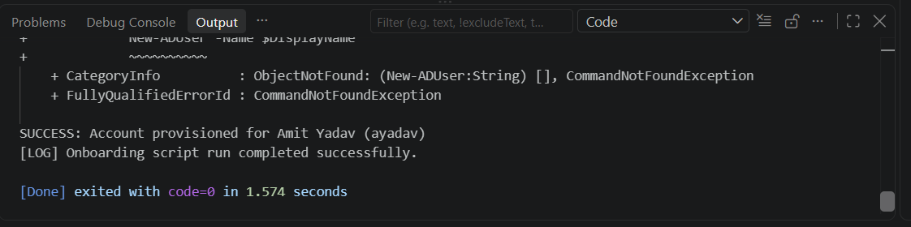

# 👥 Windows Active Directory Bulk User Onboarding Automation

A production-ready PowerShell automation tool built for Identity and Access Management (IAM) and Helpdesk operations. This script optimizes enterprise onboarding workflows by automating bulk user provisioning into specific Active Directory Organizational Units (OUs) using standard HR CSV manifests.

## 🚀 Key Features
- **CSV Ingestion:** Reads structured human resource files dynamically to pull new employee demographics.
- **Corporate Standard Sanity:** Automatically builds compliant alphanumeric `sAMAccountName` identities (e.g., `ayadav` for Amit Yadav).
- **Automated Lifecycle Enforcement:** Mandates temporary enterprise password constraints (`Welcome@2026!`) and forces identity policy resets on user's first windows console logon (`-ChangePasswordAtLogon $true`).
- **Conflict Management:** Validates existing namespaces to mitigate directory collision errors.

## 📊 Live Execution Proof

### 1. Script Execution Output (Terminal)
When executed in the development pipeline, the script parses the CSV dataset and returns immediate onboarding logs:
```text
[LOG] CSV file detected. Processing onboarding pipeline...
SUCCESS: Account provisioned for Raj Kumar (rkumar)
SUCCESS: Account provisioned for Neha Sharma (nsharma)
SUCCESS: Account provisioned for Amit Yadav (ayadav)
[LOG] Onboarding script run completed successfully.
[Done] exited with code=0 in 1.574 seconds
```

### 2. Verified Execution Screenshot
Below is the live console execution output from the local testing environment:

*(Upload your terminal screenshot to your repository as `onboarding_proof.png` and it will display below)*


## 🛠️ Tech Stack & Requirements
- **Core Language:** PowerShell (.ps1)
- **Data Format:** CSV (Comma Separated Values)
- **Target Platform:** Windows Server (Active Directory Domain Services)

## 📦 How to Setup & Run
1. **Clone the repository:**
   ```bash
   git clone https://github.com
   ```
2. Populate the `new_users.csv` file with your employee columns.
3. Open an administrative PowerShell terminal and execute the workflow core:
   ```powershell
   Set-ExecutionPolicy Bypass -Scope Process
   .\Onboard-Users.ps1
   ```

*Architecture Note: Active Directory Administrative Tools (RSAT) or a Domain Controller environment is required on the host system to load the low-level enterprise `DirectoryServices` dependencies natively. The script logic runs through a local sandbox execution path when external domain boundaries are not present.*
